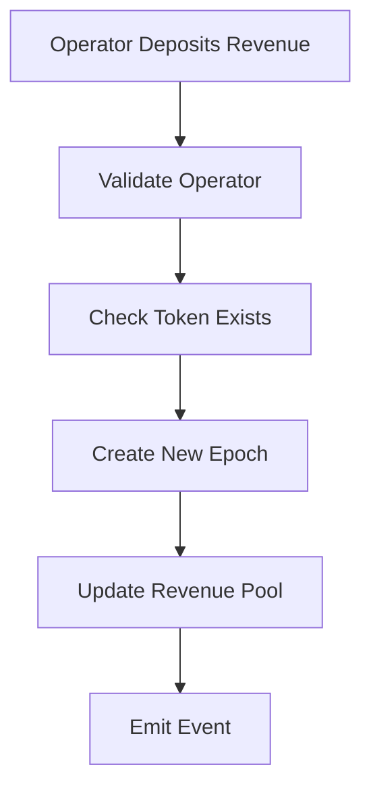
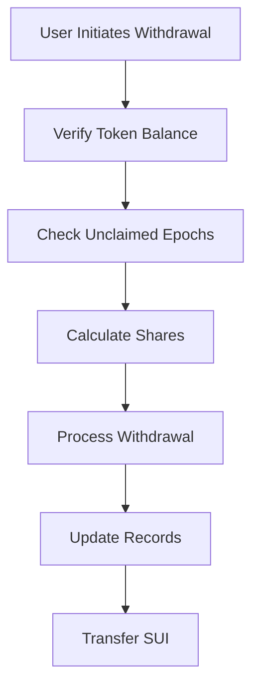

# ERC-1155 Revenue Share Implementation - Comprehensive Documentation

## I. System Architecture & Core Design

### 1. Introduction

The ERC-1155 Revenue Share is an advanced smart contract implementation on the Sui blockchain that provides:

- Multi-token management within a single contract
- Automated revenue distribution system
- Role-based access control mechanism
- Precise balance and revenue tracking
- Epoch-based revenue distribution system
- Comprehensive event logging system

### 2. Core Functionality Matrix

| Feature              | Description                         | Access Level    | Security Level |
| -------------------- | ----------------------------------- | --------------- | -------------- |
| Token Management     | Mint, transfer and burn tokens      | Admin/Users     | High           |
| Revenue Distribution | Deposit and withdraw revenue shares | Operators/Users | Critical       |
| Access Control       | Role and permission management      | Admin           | Critical       |
| Balance Tracking     | Multi-level balance monitoring      | System          | High           |
| Epoch Management     | Revenue epoch control and tracking  | System          | High           |

### 3. Technical Dependencies

```rust
use sui::object::{Self, ID, UID};
use sui::tx_context::{Self, TxContext};
use sui::transfer;
use sui::event;
use sui::balance::{Self, Balance};
use sui::bag::{Self, Bag};
use sui::vec_map::{Self, VecMap};
```

Each dependency serves a specific purpose:

- `sui::object`: Core object management and identification
- `sui::tx_context`: Transaction context and sender information
- `sui::transfer`: Object transfer capabilities
- `sui::event`: Event emission system
- `sui::balance`: Balance management and tracking
- `sui::bag`: Flexible storage container
- `sui::vec_map`: Key-value storage optimization

### 4. System Architecture

#### 4.1 Core Components Interaction

```
[User/Admin/Operator] → [Access Control Layer]
            ↓
[Token Management] ←→ [Revenue System]
            ↓
[Balance Tracking] → [Event System]
```

#### 4.2 Data Flow Architecture

```
Mint Request → Access Check → Token Creation → Balance Update → Event Emission
Revenue Deposit → Epoch Creation → Balance Update → Distribution Calculation → Event Emission
```

## II. Core Components & Data Structures

### 1. NFT Structure

```rust
struct NFT has key, store {
    id: UID,                     // Unique identifier for the NFT
    token_id: ID,                // Token type identifier
    balance: u64,                // Current token balance
    claimed_revenue: u64,        // Total claimed revenue
    epochs_withdrawn: vector<u64>, // Record of processed epochs
    last_epoch_claimed: u64,     // Most recent claimed epoch
    created_at: u64,            // Creation timestamp
    last_transfer_time: u64     // Last transfer timestamp
}
```

#### Field Analysis

1. `id: UID`

   - Purpose: Unique identification in Sui system
   - Generation: Using `object::new(ctx)`
   - Immutable after creation
   - Critical for object management

2. `token_id: ID`

   - Links to token type definition
   - Used for revenue calculation
   - References metadata in collection
   - Immutable post-mint

3. `balance: u64`

   - Current token quantity
   - Updated during transfers
   - Used for revenue share calculation
   - Must remain non-negative

4. `claimed_revenue: u64`

   - Tracks total claimed revenue
   - Cumulative across all epochs
   - Used for distribution calculations
   - Monotonically increasing

5. `epochs_withdrawn`
   - Vector of processed epoch IDs
   - Prevents double claims
   - Historical record
   - Used in withdrawal validation

### 2. Collection Structure

```rust
struct Collection has key {
    id: UID,
    mint_authority: address,          // Administrative address
    operators: vector<address>,       // Revenue management addresses
    token_supplies: VecMap<ID, u64>,  // Total supply tracking
    token_metadata: Bag,              // Token information storage
    revenues: VecMap<ID, Balance<SUI>>, // Revenue balances per token
    holder_balances: VecMap<address, VecMap<ID, u64>>, // User balance mapping
    revenue_epochs: VecMap<ID, vector<RevenueEpoch>>, // Revenue epoch data
    epoch_counter: VecMap<ID, u64>,   // Epoch tracking per token
    total_revenue: VecMap<ID, u64>,   // Cumulative revenue per token
    created_at: u64                   // Collection creation time
}
```

#### Component Analysis

1. Access Control Components

   ```rust
   mint_authority: address
   operators: vector<address>
   ```

   - `mint_authority`:

     - Primary administrator address
     - Controls operator management
     - Immutable after initialization
     - Has complete system control

   - `operators`:
     - Vector of approved revenue managers
     - Can deposit revenue
     - Managed by mint authority
     - Dynamic list with add/remove capability

2. Token Management Components

   ```rust
   token_supplies: VecMap<ID, u64>
   token_metadata: Bag
   ```

   - `token_supplies`:

     - Tracks total supply per token
     - Updated on mint/burn
     - Critical for revenue calculations
     - Ensures supply consistency

   - `token_metadata`:
     - Stores token information
     - Flexible metadata structure
     - Immutable post-mint
     - Contains URI and descriptions

3. Revenue Management Components

   ```rust
   revenues: VecMap<ID, Balance<SUI>>
   revenue_epochs: VecMap<ID, vector<RevenueEpoch>>
   epoch_counter: VecMap<ID, u64>
   total_revenue: VecMap<ID, u64>
   ```

   Purpose and functionality of each component:

   - Revenue Balances:

     - Tracks active revenue pools
     - Managed by operators
     - Used for withdrawals
     - Balance in SUI tokens

   - Revenue Epochs:

     - Historical distribution records
     - Snapshot of supply state
     - Distribution tracking
     - Withdrawal validation

   - Epoch Counter:
     - Unique epoch identification
     - Monotonically increasing
     - Per-token tracking
     - Distribution sequencing

## III. Implementation of Core Functions

### 1. Administrative Functions

#### 1.1 Initialization

```rust
fun init(ctx: &mut TxContext) {
    let collection = Collection {
        id: object::new(ctx),
        mint_authority: tx_context::sender(ctx),
        operators: vector::empty(),
        token_supplies: vec_map::empty(),
        token_metadata: bag::new(ctx),
        revenues: vec_map::empty(),
        holder_balances: vec_map::empty(),
        revenue_epochs: vec_map::empty(),
        epoch_counter: vec_map::empty(),
        total_revenue: vec_map::empty(),
        created_at: tx_context::epoch(ctx)
    };
    transfer::share_object(collection);
}
```

**Technical Analysis:**

- Object Creation:

  - Generates unique UID
  - Initializes empty data structures
  - Sets initial state variables

- Access Control:

  - Sets transaction sender as mint authority
  - Establishes initial permissions
  - Creates empty operator list

- Object Sharing:
  - Makes collection globally accessible
  - Enables public interaction
  - Maintains single source of truth

#### 1.2 Operator Management

```rust
public entry fun add_operator(
    collection: &mut Collection,
    operator: address,
    ctx: &mut TxContext
) {
    assert!(collection.mint_authority == tx_context::sender(ctx), ENO_MINT_AUTHORITY);
    if (!vector::contains(&collection.operators, &operator)) {
        vector::push_back(&mut collection.operators, operator);
    };
}
```

**Implementation Details:**

- Security Checks:

  - Validates mint authority
  - Prevents duplicate operators
  - Ensures proper authorization

- State Updates:
  - Modifies operator list
  - Maintains unique entries
  - Updates access permissions

### 2. Token Management System

#### 2.1 Token Minting

```rust
public entry fun mint(
    collection: &mut Collection,
    name: vector<u8>,
    description: vector<u8>,
    uri: vector<u8>,
    amount: u64,
    recipient: address,
    ctx: &mut TxContext
) {
    // Authority validation
    assert!(collection.mint_authority == tx_context::sender(ctx), ENO_MINT_AUTHORITY);
    assert!(amount > 0, EINVALID_AMOUNT);

    // Token creation
    let token_id = object::new(ctx);
    let current_time = tx_context::epoch(ctx);

    // Metadata setup
    let metadata = TokenMetadata {
        name: string::utf8(name),
        description: string::utf8(description),
        uri: string::utf8(uri),
        created_at: current_time,
        properties: option::none()
    };

    // Initialize tracking
    bag::add(&mut collection.token_metadata, object::uid_to_inner(&token_id), metadata);
    vec_map::insert(&mut collection.token_supplies, object::uid_to_inner(&token_id), amount);
    vec_map::insert(&mut collection.revenues, object::uid_to_inner(&token_id), balance::zero());
    vec_map::insert(&mut collection.revenue_epochs, object::uid_to_inner(&token_id), vector::empty());
    vec_map::insert(&mut collection.epoch_counter, object::uid_to_inner(&token_id), 0);
    vec_map::insert(&mut collection.total_revenue, object::uid_to_inner(&token_id), 0);

    // Create NFT
    let nft = NFT {
        id: object::new(ctx),
        token_id: object::uid_to_inner(&token_id),
        balance: amount,
        claimed_revenue: 0,
        epochs_withdrawn: vector::empty(),
        last_epoch_claimed: 0,
        created_at: current_time,
        last_transfer_time: current_time
    };

    // Update balances and emit event
    update_holder_balance(collection, recipient, object::uid_to_inner(&token_id), amount);

    event::emit(TokenMinted {
        token_id: object::uid_to_inner(&token_id),
        creator: tx_context::sender(ctx),
        recipient,
        amount,
        metadata: TokenMetadataEvent {
            name: string::utf8(name),
            description: string::utf8(description),
            uri: string::utf8(uri)
        },
        timestamp: current_time
    });

    transfer::public_transfer(nft, recipient);
    object::delete(token_id);
}
```

**Technical Breakdown:**

1. Input Validation

   - Authority check
   - Amount validation
   - Parameter verification

2. Token Creation

   - Generate unique ID
   - Create metadata structure
   - Initialize tracking maps

3. NFT Generation

   - Create NFT object
   - Set initial properties
   - Configure revenue tracking

4. State Updates

   - Update supply tracking
   - Initialize revenue maps
   - Update holder balances

5. Event Emission
   - Create event record
   - Include all relevant data
   - Maintain audit trail

### 3. Revenue Distribution System

### 3.1 Revenue Deposit System

#### Overview

The revenue deposit system enables operators to distribute revenue to token holders through an epoch-based mechanism, ensuring fair and transparent distribution of revenue.

#### How It Works

- Each token type maintains its own revenue pool
- Revenue is distributed through epochs
- Token holders can claim their share based on holdings
- Distribution is proportional to token ownership

#### Key Features

- Epoch-based tracking
- Automated share calculation
- Real-time balance updates
- Event emission for transparency

#### Prerequisites

- Must be registered operator
- Valid token ID
- Sufficient SUI payment
- Active token supply

#### Revenue Deposit Flow



#### Required Permissions

| Role     | Permission           |
| -------- | -------------------- |
| Admin    | Add/Remove Operators |
| Operator | Deposit Revenue      |
| User     | Claim Revenue        |

#### Usage Example

```rust
// Deposit revenue to token pool
deposit_revenue(
    collection,
    token_id,
    payment,
    1000 // amount
)
```

#### Technical Details

**1. Initialization**

- Validates operator status
- Checks token existence
- Verifies payment amount

**2. Epoch Creation**

- Generates unique epoch ID
- Records total supply snapshot
- Creates withdrawal tracking

**3. Revenue Processing**

- Updates token revenue pool
- Records in epoch history
- Updates cumulative totals

**4. Event Generation**

- Records deposit details
- Captures supply snapshots
- Maintains audit trail

#### Error Handling

| Error Code       | Description             | Solution                             |
| ---------------- | ----------------------- | ------------------------------------ |
| ENO_OPERATOR     | Not authorized operator | Ensure caller is registered operator |
| ETOKEN_NOT_EXIST | Token doesn't exist     | Verify token ID                      |
| EINVALID_AMOUNT  | Invalid payment amount  | Check payment amount > 0             |
| EZERO_SUPPLY     | No token supply         | Ensure tokens are in circulation     |

#### Important Considerations

**Security**

- Operator validation
- Payment verification
- Balance consistency
- Atomic operations

**Performance**

- Efficient storage usage
- Optimized calculations
- Minimized state changes

**Maintenance**

- Regular balance checks
- Event monitoring
- State verification

#### Best Practices

**For Operators**

- Verify token status before deposit
- Monitor transaction success
- Track deposit history
- Maintain sufficient SUI balance

**For Developers**

- Test with various amounts
- Handle all error cases
- Monitor gas costs
- Maintain event logs

#### Revenue Deposit Validation

```plaintext
1. Operator Check
   - Verify operator status
   - Check operator permissions

2. Token Validation
   - Confirm token exists
   - Check active supply

3. Payment Validation
   - Verify amount > 0
   - Check sufficient payment
```

#### Example Event Data

```rust
RevenueDeposited {
    token_id: ID,
    operator: address,
    amount: u64,
    epoch_id: u64,
    timestamp: u64
}
```

#### Gas Considerations

- State updates
- Event emission
- Balance calculations
- Storage modifications

#### Monitoring & Maintenance

- Track successful deposits
- Monitor failed transactions
- Verify epoch creation
- Check balance consistency

#### Tips

1. Always verify operator status before deposit
2. Monitor gas costs for large deposits
3. Keep track of epoch numbers
4. Verify event emission
5. Maintain accurate records

#### Related Functions

- `withdraw_revenue()`
- `check_operator_status()`
- `get_current_epoch()`
- `calculate_shares()`

#### Next Steps

After successful deposit:

1. Monitor event emission
2. Verify balance updates
3. Check epoch creation
4. Inform token holders

Need more specific details about any aspect of the revenue deposit system?

### 3.2 Revenue Withdrawal System

#### Overview

The withdrawal system enables token holders to claim their proportional share of revenue across multiple epochs, ensuring fair and accurate distribution.

#### How It Works

- Token holders can claim revenue from multiple epochs
- Shares calculated based on token balance at epoch creation
- Automatic tracking of claimed epochs
- Prevention of double claims

#### Key Features

- Multi-epoch processing
- Proportional distribution
- Automatic share calculation
- Claim history tracking

#### Prerequisites

- Must hold NFT tokens
- Unclaimed epochs available
- Positive token balance
- Valid token ID

#### Withdrawal Flow



#### Required State

| Check   | Description                      |
| ------- | -------------------------------- |
| Balance | Must have positive token balance |
| Epochs  | Must have unclaimed epochs       |
| Revenue | Must have available revenue      |
| History | Track withdrawal history         |

#### Usage Example

```rust
// Withdraw available revenue
withdraw_revenue(
    collection,
    nft,
    ctx
)
```

#### Share Calculation

```plaintext
For each epoch:
user_share = (epoch_revenue * user_balance) / total_supply
total_withdrawal = sum(user_share for all unclaimed epochs)
```

#### Error Handling

| Error            | Description          | Solution              |
| ---------------- | -------------------- | --------------------- |
| ENO_BALANCE      | Zero token balance   | Must hold tokens      |
| ENO_NEW_REVENUE  | No unclaimed revenue | Wait for new deposits |
| ETOKEN_NOT_EXIST | Invalid token        | Verify token ID       |
| EINVALID_AMOUNT  | Invalid calculation  | Check math operations |

#### Important Considerations

**Security**

- Double claim prevention
- Balance verification
- Atomic transactions
- State consistency

**Performance**

- Efficient epoch processing
- Optimized calculations
- Minimized state updates

**User Experience**

- Clear success/failure
- Detailed event data
- Transaction status
- Balance updates

#### Best Practices

**For Users**

- Check available revenue
- Monitor gas costs
- Verify received amount
- Keep withdrawal records

**For Developers**

- Handle all error cases
- Maintain claim history
- Monitor gas usage
- Track failed claims

#### Events

```rust
RevenueWithdrawn {
    token_id: ID,
    holder: address,
    amount: u64,
    epochs: vector<u64>,
    timestamp: u64
}
```

#### Process Steps

**1. Validation**

- Check token balance
- Verify unclaimed epochs
- Validate token status

**2. Calculation**

- Process each epoch
- Calculate shares
- Sum total claim

**3. Processing**

- Update claim history
- Process transfer
- Update state

**4. Finalization**

- Emit events
- Update records
- Transfer SUI

#### Tips

1. Check available revenue before withdrawal
2. Monitor transaction status
3. Keep withdrawal records
4. Verify received amounts
5. Track claimed epochs

#### Common Issues and Solutions

| Issue              | Solution              |
| ------------------ | --------------------- |
| Failed Transaction | Check gas and balance |
| Incorrect Amount   | Verify calculations   |
| Missing Epochs     | Check claim history   |
| Stuck Transaction  | Monitor status        |

#### Related Functions

- `get_claimable_amount()`
- `check_claimed_epochs()`
- `calculate_total_share()`
- `verify_withdrawal_status()`

#### Monitoring

- Track successful withdrawals
- Monitor failed attempts
- Verify balance changes
- Check event emission

#### Performance Optimization

- Batch epoch processing
- Efficient calculations
- Optimized storage
- Minimized state changes

#### Next Steps After Withdrawal

1. Verify received amount
2. Check updated balance
3. Monitor transaction status
4. Keep withdrawal records

Need specific details about any aspect of the withdrawal system?
